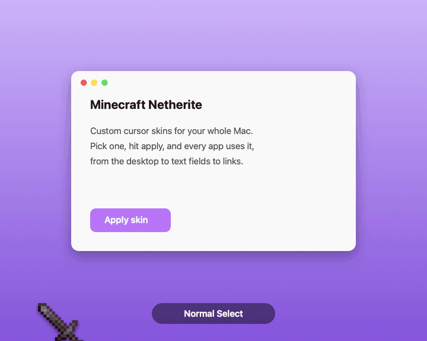

# MouseSkins

Custom mouse cursors for your whole Mac. Pick a skin, hit apply, and every app uses it.



*Shown: the Minecraft Netherite skin by [jaqna](https://www.rw-designer.com/user/113017).*

## What it does

- **Applies cursor skins system-wide**: the arrow, the pointing hand, the text cursor, the spinner and the resize arrows.
- **Finds skins for you**: browse about 50 free skins from GitHub and install one in a click.
- **Lets you tweak them**: move a cursor's click point, change animation speed, swap images.
- **Swing on click**: with a sword skin, every click swings the pointer like a Minecraft sword.
- **Stays out of the way**: lives in the menu bar and uses about 15 MB of memory.

## Install

Needs macOS 13 or later and Xcode's command line tools (`xcode-select --install`).

```sh
git clone https://github.com/Christianships/MouseSkins.git
cd MouseSkins
./build.sh
```

This installs `MouseSkins.app` in `~/Applications` and a `mouseskins` command in `~/.local/bin`.

## Use

Open MouseSkins and a panel pops up in the middle of your screen. It has four tabs:

| Tab | What it's for |
| --- | --- |
| **Home** | Your skins. Double-click one to apply it. |
| **Skins** | Browse and download new skins. |
| **Edit** | Adjust the selected skin's cursors. |
| **Settings** | Open at login, cursor size, left-handed mode, swing on click. |

Press Esc or click anywhere else to close it. The cursor icon in the menu bar opens the panel again and lets you switch skins quickly.

Prefer the terminal?

```sh
mouseskins skins bibata    # search downloadable skins
mouseskins get Bibata      # download one
mouseskins apply Bibata    # use it
mouseskins scale 1.5       # make cursors bigger
mouseskins reset           # back to the normal macOS cursors
```

Run `mouseskins help` for everything else.

## Getting skins

- **Skins tab**: search, then **Get** or **Get & Apply**. Use **+** to add any GitHub repo that has `.cape` files.
- **`.cape` files you already have**: drag them onto the panel, or run `mouseskins import file.cape`.

## Swing on click

Turn on **Swing on click** in Settings (or the menu bar menu) and every left
click plays one quick swing, like hitting something in Minecraft: the cursor
winds up to the right, sweeps across to the left around its handle, and snaps
back, in about a fifth of a second. It swings the **Normal Select** and
**Link Select** cursors, so it's made for sword skins like Minecraft Netherite.
Other cursors (text, resize) don't swing.

## Making your own

Make a folder with one PNG per cursor and a `theme.json`:

```
My Theme/
├── theme.json
├── arrow.png        (32×32, add arrow@2x.png at 64×64 for sharp Retina)
└── pointing.png
```

```json
{
  "name": "My Theme",
  "cursors": {
    "arrow":    { "hotspot": [4, 2] },
    "pointing": { "hotspot": [10, 3] }
  }
}
```

`hotspot` is the exact pixel that clicks, measured from the top-left. Run `mouseskins names` for every cursor you can replace. Then drop the folder onto the panel.

## Good to know

- **Getting the normal cursors back**: MouseSkins saves a copy of the macOS cursors the first time it runs after you log in. Until then, **reset** only fully works after a logout.
- **Use one cursor app at a time**: two apps changing cursors will keep undoing each other.
- **AeroSpace users**: keep the panel floating by adding this rule:

  ```toml
  [[on-window-detected]]
      if.app-id = 'dev.christianaguilar.mouseskins'
      run = ['layout floating']
  ```

<details>
<summary>How it works</summary>

MouseSkins uses private macOS window-server calls (`CGSRegisterCursorWithImages`, see `Sources/CGSPrivate.h`) to replace named system cursors for the whole login session. On macOS 26 the arrow and text cursor are also drawn under a second name (`ArrowS`, `IBeamS`), so it registers both. It re-applies your skin after sleep, display changes and logins. The panel runs as its own short-lived process so the menu bar app stays small.

Swing on click can't animate the real pointer: macOS only redraws it when the app underneath asks, so a swapped-in animated cursor gets missed or stuck looping. Instead, on each click MouseSkins hides the pointer for the length of the swing and plays it in a transparent, click-through overlay that follows the mouse (`Sources/Swing.swift`). The overlay and the real pointer overlap for a moment at each end, so it never blinks.

</details>
